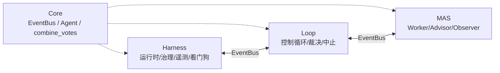

# stability-check

**领域无关的自治循环稳定性测试框架（三引擎架构）。**

用「Harness / Loop / MAS」三引擎构建自治循环系统，对门禁对讲等设备进行
长周期压力-探测-恢复的稳定性验证；事实独裁裁决 + 看门狗防死锁 + 治理熔断，
保证循环一定终止且结论可解释。

## 核心特性

- **三引擎互不 import** —— `core/` 契约内核(EventBus / Agent / combine_votes)是三引擎共同依赖;
  `harness ←(EventBus)→ loop ←(EventBus)→ multi_agent`,跨引擎通信只走事件总线,边界在模块层强制。
- **事实独裁(安全底线)** —— `DecisionAuthority` 拥有唯一裁决权:任一事实为
  `False` 即本轮 `fail`,不可被风险分或投票翻转为 `pass`。
- **零第三方依赖** —— 框架核心仅用标准库(`asyncio` / `logging` / `time` / `math` / `random` / `secrets`)。
- **数据驱动场景层** —— 把「重启 / 升级 / 下发 / 长巡」类用例抽象成 `target` + `stress`
  + `probe` + `loop` 四段 YAML;`capabilities/`(actions / probes / preconditions)原子化能力
  被 `ScenarioWorker` 装配调度,新增用例零代码改动。
- **可观测与治理** —— 遥测(trace / metric / log / fact)、看门狗心跳、Governance 熔断/鉴权、
  多 Advisor 加权投票 + Observer 面板,全部经总线落地。

## 快速开始

```bash
# 安装（可选 rich 美化终端输出）
pip install -e .[examples]

# 通用装配模板（合成 / 真实设备双模式，env 驱动）
python stability_harness_loop_multiagent/examples/generic_harness.py
```

```bash
# 运行全部测试（无 HIK_HOST 自动 skip 真机用例）
pytest tests/ -v

# 纯逻辑单元测试（不需真机，秒级完成）
pytest tests/ -v --ignore=tests/test_stability_scenario.py

# 跑一份 YAML 场景（需 .env 配 HIK_HOST）
python -m stability_harness_loop_multiagent.examples.scenario_run \
    --scenario configs/stability_0001_reboot.yaml --rounds 3
```

## 三引擎架构



| 层 | 职责 | 包路径 |
|------|------|--------|
| **Core** | 契约内核(EventBus / Agent / combine_votes,零内部依赖) | `stability_harness_loop_multiagent/core/` |
| **Harness** | 运行时 / 治理 / 可观测 / 校验 / 看门狗 | `stability_harness_loop_multiagent/harness/` |
| **Loop** | 确定性控制循环 / 裁决 / 中止 / 调度 | `stability_harness_loop_multiagent/loop/` |
| **MAS** | 领域执行 / 建议 / 观察 | `stability_harness_loop_multiagent/multi_agent/` |
| **Business** | 领域装配层(Hikvision + Scenario YAML + capabilities) | `stability_harness_loop_multiagent/business/hikvision/` |

## 设计文档

- [架构演进路线](plans/架构演进路线.md) — P0~P3 演进路线与已落地项
- [门禁对讲通用稳定性用例集](plans/门禁对讲通用稳定性用例集.md) — 108 条用例集
- [门禁设备稳定性测试框架设计方案](plans/门禁设备稳定性测试框架设计方案.md)
- [用例模板](plans/2026-07-15-stability-harness-loop-multiagent-template.md)

## 架构演进分析

- [分析报告](plans/architecture-evolution/analysis-report.md)
- [设计](plans/architecture-evolution/design.md)
- [计划](plans/architecture-evolution/plan.md)

## 门禁对讲实现记录

- [稳定性设计（spec）](superpowers/specs/2026-07-17-hikvision-door-stability-design.md)
- [稳定性实现（impl）](superpowers/plans/2026-07-17-hikvision-door-stability-impl.md)

## 本地预览文档站

```bash
pip install -e .[docs]
mkdocs serve
```
