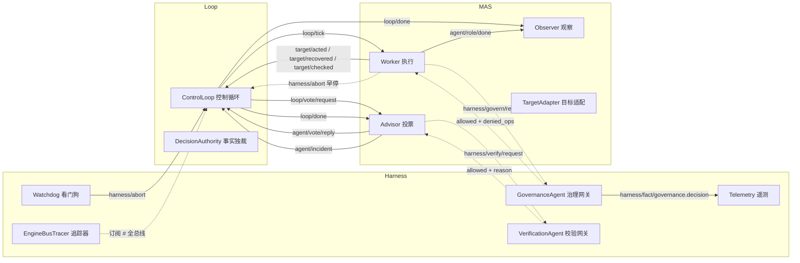
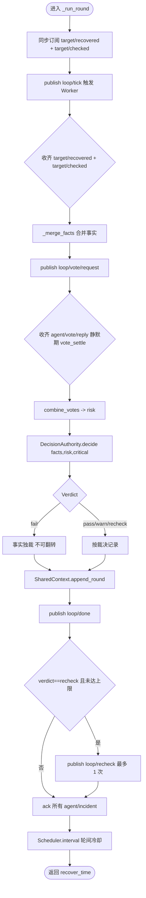
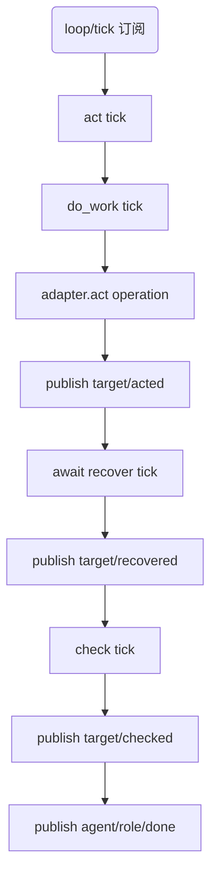
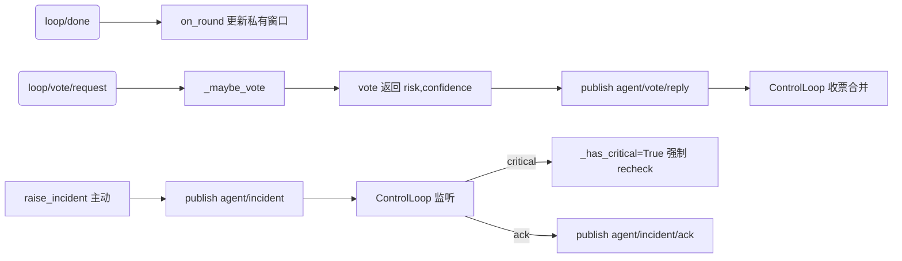
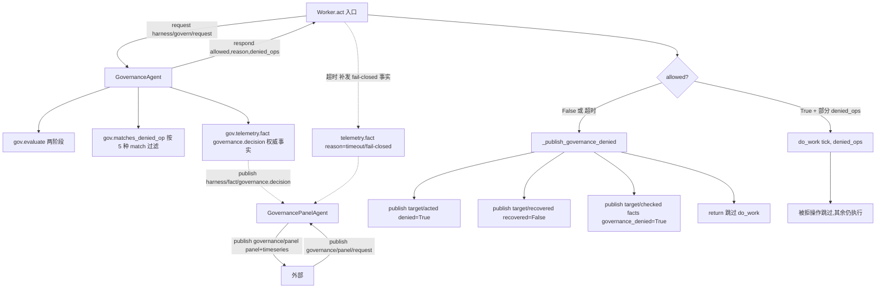
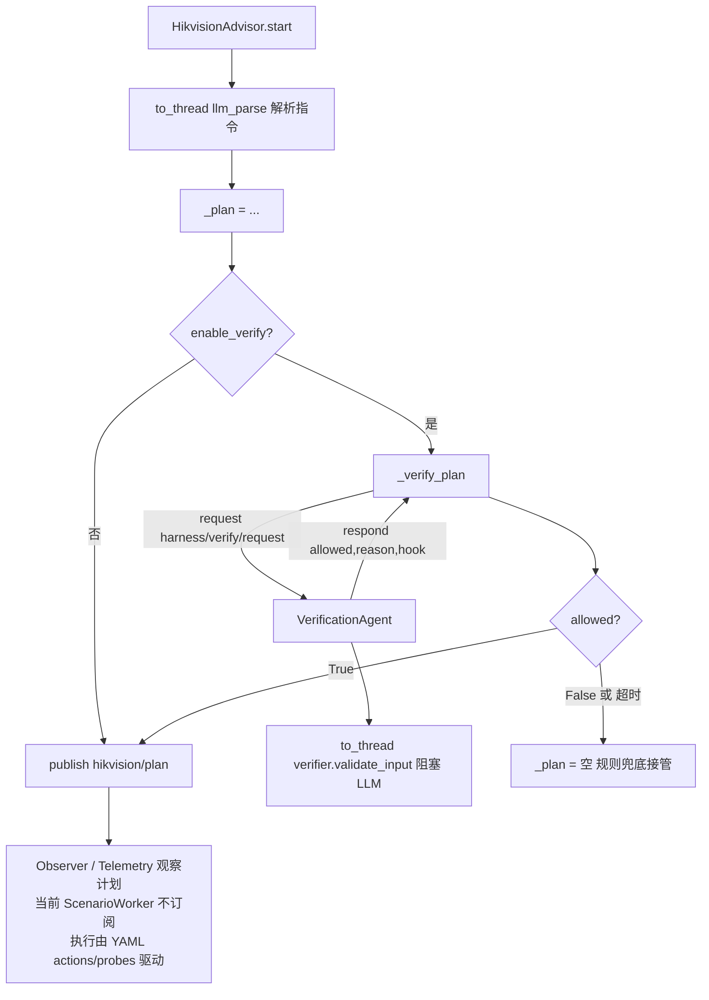
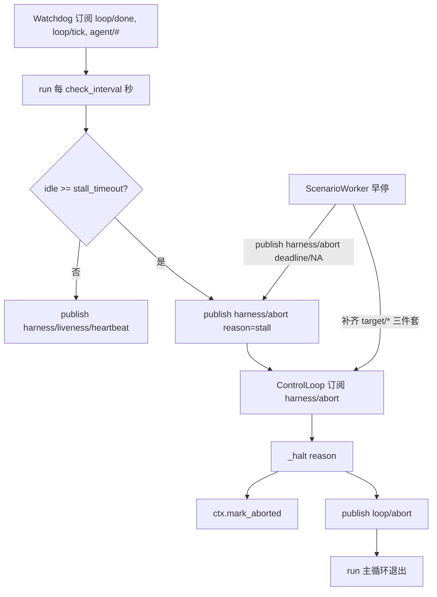
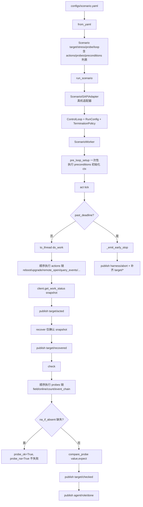
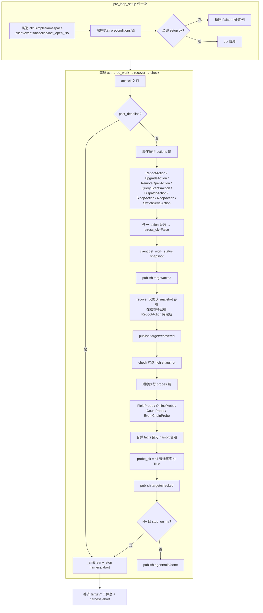

# 事件链与执行链索引

> 本文档固化 `stability_harness_loop_multiagent` 中可复用的事件链与执行链,
> 每条链都标注源文件位置,便于在新增场景时按链复用而非重新设计。
> 静态架构见 [系统架构图](系统架构.md),本文是动态视角的补充。

---

## 0. 总览

所有跨引擎通信走 `EventBus`,话题是契约字符串。下图画出主要组件与话题流向。



---

## 1. ControlLoop 一轮标准事件链(架构骨架)

每轮 `_run_round` 严格按以下顺序,所有场景共享。源文件:
[`loop/driver.py`](https://github.com/sunbos/stability-check/blob/master/stability_harness_loop_multiagent/loop/driver.py)。



| 步骤 | 话题 / 调用 | 行号 | 说明 |
|------|-------------|------|------|
| 0 | (内部订阅) | L143-L144 | 在 publish 之前订阅,避免 fire-and-forget 丢失 |
| 1 | publish `loop/tick` | L145 | 触发 Worker |
| 2 | 等待 `target/recovered` + `target/checked` | L149-L160 | 事件驱动 + 超时兜底 |
| 3 | `_merge_facts()` | L166 | 无 facts → 注入 `checks_received=False` |
| 4 | publish `loop/vote/request` | L293 | 请求 Advisor 投票 |
| 5 | 等待 `agent/vote/reply` | L298-L313 | 静默期 `vote_settle` 提前返回 |
| 6 | `combine_votes(votes)` | L170 | 来自 `core.voting` |
| 7 | `DecisionAuthority.decide(...)` | L172 | 事实独裁;异常 → 保守 warn(60) |
| 8 | `SharedContext.append_round` | L200 | 独占写入 |
| 9 | publish `loop/done` | L202-L212 | Advisor / Scribe / Observer / Telemetry 收 |
| 10 | publish `loop/recheck`(可选) | L223-L225 | `recheck_limit` 上限为 1 |
| 11 | publish `agent/incident/ack` | L230-L234 | 对本轮事件 ACK |
| 12 | `Scheduler.interval` + sleep | L117-L119 | 轮间冷却 |

**复用要点**:任何新场景自动复用这条链——只要 Worker 发布 `target/recovered` + `target/checked`,Loop 接管裁决、记录、投票收集、recheck、ack、调度。

---

## 2. Worker 标准流水线(MAS 通用)

源文件:`multi_agent/workers/base.py`。



**复用要点**:`WorkerAgent` 基类已固化 `act → recover → check → publish` 顺序,子类只需重写 `do_work` / `recover` / `check`。`ScenarioWorker`(场景化主路径)与 `ExampleWorkerAgent`(演示)都按此契约覆写 `act()`。

---

## 3. 投票链(Advisor → Loop)

源文件:`multi_agent/advisors/base.py`。



**复用要点**:新 Advisor 只要实现 `vote()` 即可,无需关心总线时序。`critical` 事件自动触发 `recheck`,这是固化在 Loop 里的安全网。

---

## 4. 治理链(网关 + 闸门 + 面板)

P1 演进固化的最完整链条,4 个组件经总线协作。源文件:
`harness/governance.py` + `multi_agent/observers/gov_panel.py`。



**fail-closed 语义**:网关超时 / 拒绝只拦操作、不 halt 循环(`emit_abort` 默认 `False`)。Worker 跳过被拒操作(如 `reboot`)仍执行其余操作(如 `remote_open_door`)。

**复用要点**:这套链条**完全通过话题字符串契约**,Worker 不 import governance。任何新 Worker 接入治理只要在 `act()` 入口调一次 `governance_decision()` 即可。

---

## 5. 校验链(LLM 护栏,Advisor 侧触发)

源文件:`business/hikvision/advisor.py` + `harness/verify.py`。



> 注:历史 `HikvisionWorker` 已删除,被 `ScenarioWorker` + `capabilities/` 取代(见第 8 节)。
> `hikvision/plan` 仍由 `HikvisionAdvisor` 发布,主要供 Telemetry / Observer 观察用;
> 当前场景化执行路径(`ScenarioWorker`)直接由 YAML 的 `actions` / `probes` / `preconditions`
> 驱动,不再消费 `hikvision/plan` 缓存到 worker state。

**复用要点**:"LLM 产物经总线校验后才生效"的标准模板,可移植到任何 LLM 产物(计划/配置/补丁)需要护栏的场景。fail-closed:校验失败 / 超时即丢弃计划,由规则兜底接管,绝不乐观采纳。

---

## 6. 看门狗 → 中止链(安全网)

源文件:`harness/watchdog.py`。



**复用要点**:`harness/abort` 是所有"外部强制停止"的统一接缝——看门狗、治理(可选 `emit_abort=True`)、Worker 早停都走同一条链。早停方必须补齐 `target/*` 三件套,否则 Loop 会因收不到 `target/checked` 而判 fail。

---

## 7. 场景化数据驱动链(YAML → ControlLoop)

最高层复用:YAML 一份即一条用例,零代码。源文件:
`business/hikvision/scenario_runner.py` + `scenario_worker.py`。



> 注:`FakeScenarioAdapter` 与 `--dry-run` 已删除(测试不变量禁止 fake/mock)。
> 真实设备验证走 `examples/scenario_run.py`,无 `HIK_HOST` 时 pytest 自动 skip 真机用例。

**事实独裁契约**:
- `probe_ok=False` → `DecisionAuthority` 强制 `fail`
- `probe_na=True`(字段缺失) → 不失败,NA 跳过
- 早停必发 `harness/abort` + 补齐 `target/*` 三件套

**复用要点**:"配置即用例"的固化模板。新增用例 = 复制 `configs/scenario_template.yaml` 改字段。108 条门禁用例都按此链执行。

---

## 8. 场景化能力组合链(ScenarioWorker + capabilities,当前主路径)

> 历史 `HikvisionWorker.do_work`(原 `business/hikvision/worker.py`)已删除,被
> `ScenarioWorker` + `capabilities/` 抽象取代:把"远程触发 + 事件链验证 + 重启恢复"
> 拆成原子能力(actions / probes / preconditions),由 YAML 装配调度,新增用例零代码改动。

`ScenarioWorker` 的流水线,基于 `business/hikvision/scenario_worker.py` + `capabilities/`。



**事实独裁契约**(由 `ScenarioWorker.check` + `DecisionAuthority` 共同保证):
- 任一普通 fact 为 `False` → `probe_ok=False` → `DecisionAuthority` 强制 `fail`
- `_na` 后缀 fact 为 `True` → 标记 NA,`probe_ok=True, probe_na=True` → 不判失败
- `_soft` 后缀 fact → 软事实(如门关闭状态),缺失只抬高风险,不强制 fail
- 早停(deadline / NA-stop)必发 `harness/abort` + 补齐 `target/*` 三件套

**Capabilities 跨轮状态共享**(通过 `ctx: SimpleNamespace`):
- `ctx.client`: `HikvisionClient` 实例(从 adapter 获取)
- `ctx.events`: 事件链查询结果(`QueryEventsAction` 写入,`EventChainProbe` 读取)
- `ctx.baseline`: 基线 serialNos + 可选 reboot_duration(`BaselineRecordPrecondition` 写入)
- `ctx.last_open_iso`: 上次 remote_open 设备时间(`RemoteOpenAction` 写入,`QueryEventsAction` 读取)

**复用要点**:
- 这条链是**数据驱动场景层**(P4 演进)的核心抽象,新增用例 = 复制 YAML 改字段,零代码改动
- 模式可移植到其他"远程触发 + 事件链验证 + 重启恢复"设备,只需实现新的 `TargetAdapter` + 新增 `capabilities/*` 原子能力
- `asyncio.to_thread` 包裹 `do_work`(长 IO)是固化的安全网,避免冻结事件循环

---

## 9. 可观测链(Telemetry + Tracer)

源文件:`harness/tracer.py` + `harness/telemetry.py`。

```
任何组件 publish 任意话题
   ↓
EngineBusTracer(订阅 "#")  全总线通配
   ├─ engine_of(topic) → Loop / MAS / Harness / Other
   └─ 归一化为带 engine 归属的结构化记录

ControlLoop 内显式调用:
   telemetry.metric("loop.round", round_no)
   telemetry.metric("loop.verdict", 1.0, decision=..., risk=..., round=...)
   telemetry.fact("governance.decision", allowed=..., reason=..., denied_ops=..., ...)

Sinks:
   ├─ MemorySink    测试断言
   ├─ PrintSink     实时观察
   └─ NullSink      默认无输出

ScribeAgent(订阅 loop/done, agent/incident, loop/abort)
   └─ 私有时间线 + 响应 scribe/summary/request 回发 scribe/summary
```

**复用要点**:`EngineBusTracer` 是零侵入的全局可观测入口,任何新话题自动被归类。`telemetry.fact(name, ...)` 是发结构化事实的标准方式,governance 面板就靠它聚合。

---

## 10. 终止链(TerminationPolicy)

源文件:`loop/termination.py` + `loop/driver.py`。

```
每轮 _run_round 之前 + 之后都检查:
   termination.should_halt(ctx.snapshot())
      ↓ OR 组合所有 StopCondition
   ├─ CountStop(max_rounds)              轮数到
   ├─ DurationStop(max_duration)         墙钟到
   ├─ FailThresholdStop(cumulative/consecutive)  失败累计/连续
   ├─ ExternalAbortStop(bus)             订阅 harness/abort
   └─ ExternalStop(bus)                  外部信号
      ↓
   halt=True → _halt(reason)
      ├─ _stop = True
      ├─ ctx.mark_aborted(reason)
      └─ publish loop/abort {reason}
```

**复用要点**:`RunConfig.build_termination()` 把声明式参数映射到 `TerminationPolicy`,新场景只要填 `RunConfig` 即可,无需手拼终止条件。

---

## 复用矩阵

| 想做什么 | 复用哪条链 | 改什么 |
|---------|-----------|--------|
| 加一条新稳定性用例 | 7(场景化) | 写 YAML |
| 加一种新设备类型 | 2(Worker) + 8(参考) | 实现 `TargetAdapter` + 新增 `capabilities/*` 原子能力 + 写 YAML 场景 |
| 加一个风险分析 Agent | 3(投票链) | 实现 `AdvisorAgent.vote()` |
| 加一个观察/记录/通知 Agent | 9(可观测) | 实现 `ObserverAgent.on_event()` |
| 加 LLM 产物护栏 | 5(校验链) | 在产物采纳前调 `harness/verify/request` |
| 加操作鉴权/熔断 | 4(治理链) | Worker `act()` 入口调 `governance_decision()` |
| 加新停止条件 | 10(终止链) | 实现 `StopCondition` 加入 `TerminationPolicy` |
| 加外部强制中止 | 6(看门狗) | `publish harness/abort` |
| 加新可观测维度 | 9(可观测) | `telemetry.fact(name, ...)` + Observer 订阅 |

---

## 设计不变量(所有链共享)

1. **引擎隔离**:三引擎互不 import,所有跨引擎通信走 EventBus。
2. **事实独裁**:任一事实 `False` → `fail`,不可被风险分或投票翻转。
3. **超时兜底**:每个跨引擎 `await` 都有超时 + 确定性兜底,循环一定终止。
4. **fail-closed**:治理 / 校验网关超时或异常一律拒绝,绝不乐观放行。
5. **不可变快照**:Agent 通过 `ReadOnlyContext` 观察,私有状态在 `self.state`。
6. **早停必补齐**:任何早停方必须发 `harness/abort` + 补齐 `target/*` 三件套。
