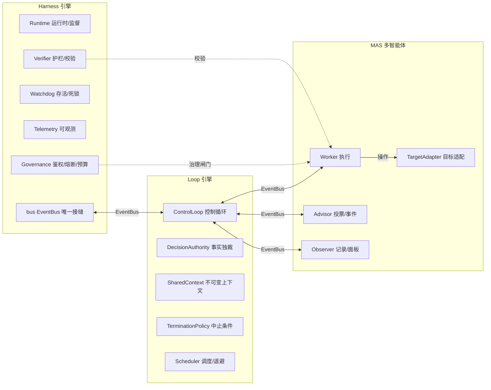
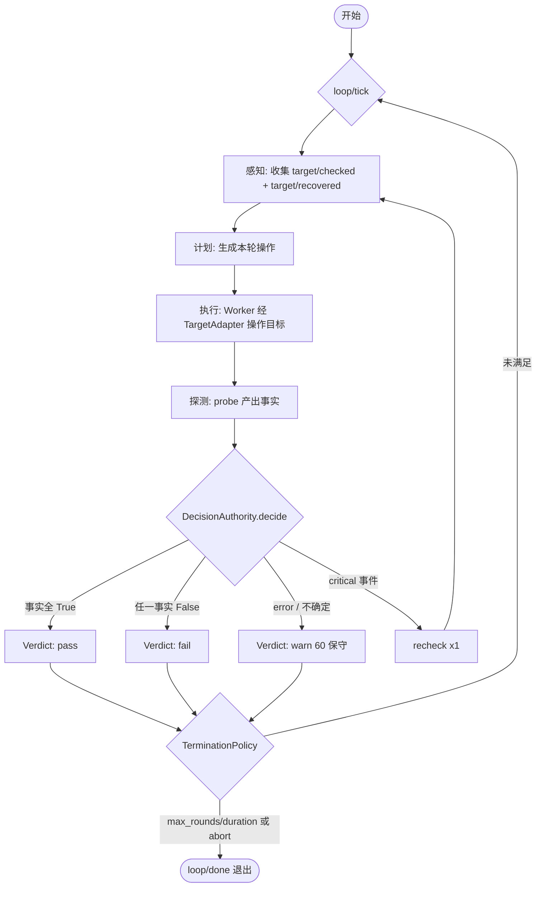
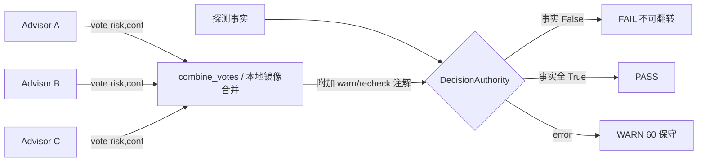
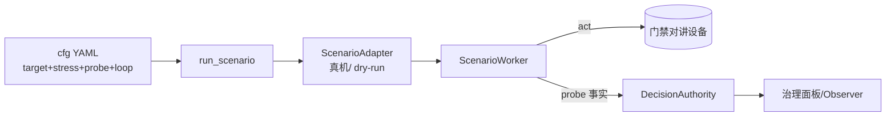

# 系统架构图

> 本文档用 Mermaid 描述 `stability_harness_loop_multiagent` 的架构，
> 对应 `AGENTS.md` 与三引擎设计。三引擎在**模块层**强制互不 import，
> 所有跨引擎通信只走 `EventBus`（pub/sub + request/reply + `#` 通配）。

## 1. 三引擎总览

`harness ←(EventBus)→ loop ←(EventBus)→ multi_agent`，边界在模块层强制。

## 2. 控制循环（ControlLoop）

`sense → plan → act → check → decide → halt` 的确定性循环，每轮必产生 `Verdict`，
且受 `max_rounds` / `max_duration` 硬上限保证一定终止。

## 3. 投票与事实独裁

Advisor 只投 `(risk, confidence)`，不裁决；`DecisionAuthority` 拥有唯一裁决权。
任一事实为 `False` → 本轮 `fail`，不可被风险分或投票翻转为 `pass`。

## 4. 数据驱动场景层（门禁对讲）

零代码新增用例：复制 YAML 模板改字段，`scenario_worker` 把探测结果产出事实交给 `DecisionAuthority`。

## 不变量速记

- **循环终止**：`max_rounds` / `max_duration` 硬上限，不可能死锁。
- **裁决产生**：每轮必出 `Verdict`。
- **事实独裁**：注入失败事实强制 `fail`，即使 Advisor 投低风险。
- **事件扇出**：Observer 必收 `loop/done`，总线端到端可用。
- **防死锁**：每个跨引擎 `await` 都有超时 + 确定性兜底；`recheck` 上限 1 次。
